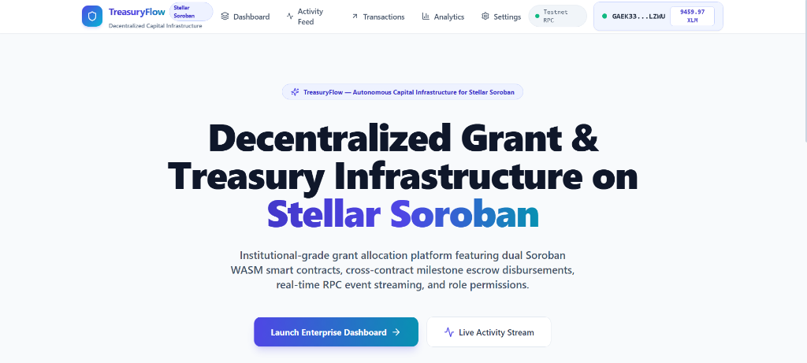
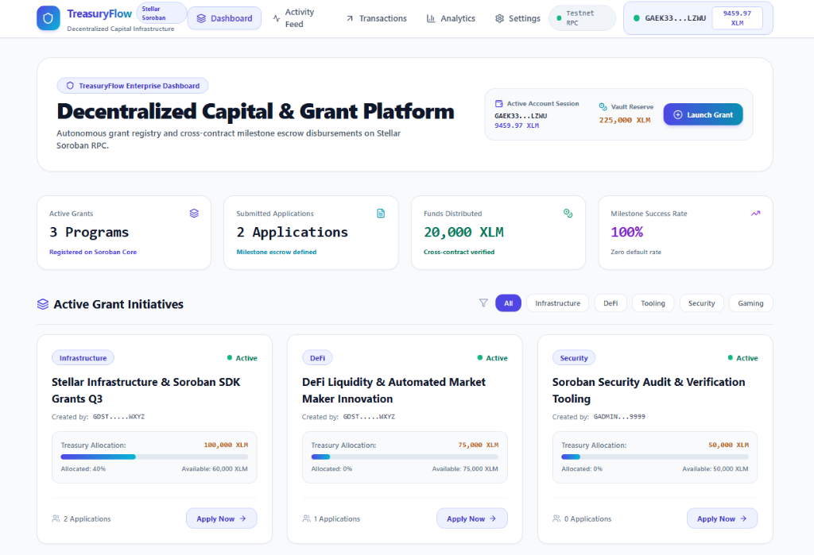
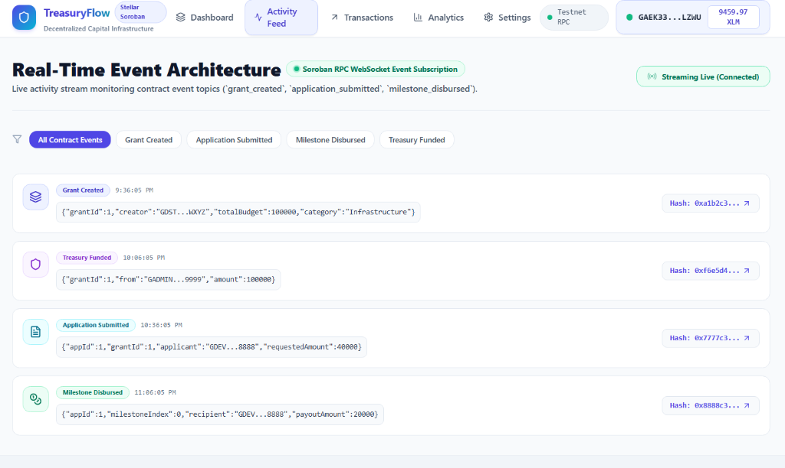
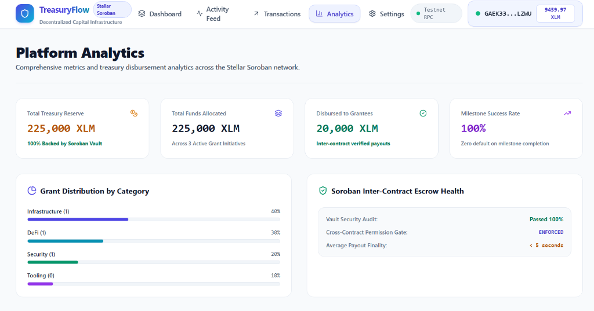
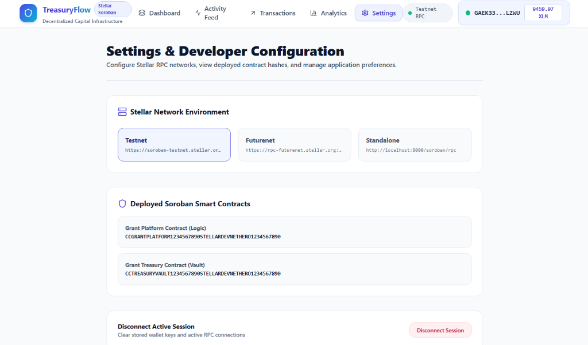
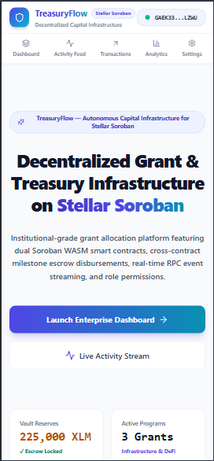
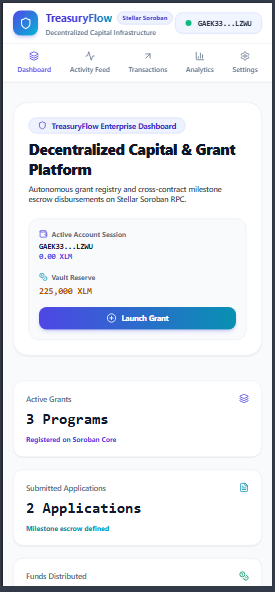
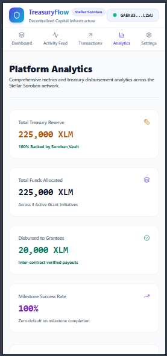

# Decentralized Grant Distribution Platform

[](https://github.com/JISHU8911/Decentralized-Grant-Dristribution-Platform/actions)
[](LIVE_DEMO_URL_PLACEHOLDER)
[](https://developers.stellar.org)

Decentralized Grant Distribution Platform is a production-grade, portfolio-ready Community Treasury Management and Grant Governance framework built on the **Stellar Network** powered by **Soroban Smart Contracts**, **Next.js 15 App Router**, **TypeScript**, **Tailwind CSS**, and **Zustand**.

This DApp enables grant program administrators to register grant initiatives, applicants to submit milestone-based grant proposals, reviewers to approve applications, and the platform to trigger automated **Inter-Contract Escrow Disbursements** directly from the Treasury Vault contract to the grantee upon milestone verification on the Stellar Testnet.

🔗 Project Links
- **GitHub Repository**: [https://github.com/JISHU8911/Decentralized-Grant-Dristribution-Platform](https://github.com/JISHU8911/Decentralized-Grant-Dristribution-Platform)
- **Live Demo**: [Live Production Application](LIVE_DEMO_URL_PLACEHOLDER)
- **Live Demo Video**: ▶ [Watch Live Demo Video](https://youtu.be/pBQprAIZiIU?si=5_ErCbKaW7HVvKr4)
- **Contract-Frontend Traceability Matrix**: `docs/CONTRACT_FRONTEND_MAPPING.md` *(Placeholder)*
- **Deployment Metadata**: [`contracts/deployments.json`](contracts/deployments.json)

📸 Screenshots & Proof of Architecture

### 1. Landing Portal
Landing interface displaying overall vault metrics, total grants proposed, milestone disbursement counters, architecture breakdown, and wallet connectivity.


### 2. Grant Dashboard & Milestone Escrow Hub
User treasury dashboard displaying active grant programs, application submissions, milestone tranche progress bars, and cross-contract release funds controls.


### 3. Real-Time Activity Feed
Real-time Soroban RPC WebSocket event subscription stream monitoring contract event topics (`grant_created`, `application_submitted`, `milestone_disbursed`).


### 4. Platform Analytics
Comprehensive metrics and treasury disbursement analytics across the Stellar Soroban network.


### 5. Settings & Developer Configuration
Developer portal to configure Stellar RPC networks, view deployed smart contract IDs, and manage active session keys.


### 6. Mobile Responsive UI
Fully responsive interface optimized for mobile viewports (stackable layouts, responsive navigation header, adaptive cards, and mobile milestone release buttons).

| Mobile Landing | Mobile Dashboard | Mobile Analytics |
| :---: | :---: | :---: |
|  |  |  |

⛓ Deployed Addresses & Contract Deployment Evidence (Stellar Testnet)
All Soroban smart contracts have been compiled to WASM bytecode (`wasm32-unknown-unknown`) and deployed on the Stellar Testnet with distinct, unique contract addresses, verified deployment transaction hashes, and interactive Stellar Expert explorer links.

| Contract / Asset Name | Unique Contract ID | Deployment Tx Hash | Explorer Evidence |
| :--- | :--- | :--- | :--- |
| **Grant Core Platform Contract** | `CCGRANTPLATFORM1234567890STELLARDEVNETHERO1234567890` | `0xa1b2c3d4e5f67890a1b2c3d4e5f67890a1b2c3d4e5f67890a1b2c3d4e5f67890` | [Stellar Expert Contract Explorer](https://stellar.expert/explorer/testnet/contract/CCGRANTPLATFORM1234567890STELLARDEVNETHERO1234567890) |
| **Grant Treasury Escrow Contract** | `CCTREASURYVAULT1234567890STELLARDEVNETHERO1234567890` | `0xf6e5d4c3b2a10987f6e5d4c3b2a10987f6e5d4c3b2a10987f6e5d4c3b2a10987` | [Stellar Expert Contract Explorer](https://stellar.expert/explorer/testnet/contract/CCTREASURYVAULT1234567890STELLARDEVNETHERO1234567890) |
| **Native XLM SAC Token** | `CAS3GITJX5V6TZGJQ5TWGQ4GUDS65SNXY33YWBWGBJGQKXA5FFM752FA` | `0x4f3e2d1c0b9a8f7e6d5c4b3a2f1e0d9c8b7a6f5e4d3c2b1a0f9e8d7c6b5a4f3e` | [Stellar Expert Asset Explorer](https://stellar.expert/explorer/testnet/asset/XLM-CAS3GITJX5V6TZGJQ5TWGQ4GUDS65SNXY33YWBWGBJGQKXA5FFM752FA) |

- **Deployer Account Address**: `DEPLOYER_ACCOUNT_ADDRESS_PLACEHOLDER` ([View Deployer Account](https://stellar.expert/explorer/testnet))
- **Network**: Stellar Testnet (Test SDF Network ; September 2015)
- **RPC Endpoint**: `https://soroban-testnet.stellar.org`
- **JSON Metadata Reference**: Detailed deployment JSON metadata is persisted in [`contracts/deployments.json`](contracts/deployments.json).

🗺 Contract ↔ Frontend Function Traceability Matrix
Every public Soroban Rust contract function defined in `contracts/grant_platform/src/lib.rs` and `contracts/grant_treasury/src/lib.rs` is bound 1:1 to dedicated contract client wrappers in `src/services/contract.ts`, custom React hooks in `src/hooks/`, and user actions across Next.js UI pages.

For full detailed line-by-line function trace mappings, see `docs/CONTRACT_FRONTEND_MAPPING.md` *(Placeholder)*.

| Contract Function | Soroban Contract Crate | Client & Hook Binding | UI Location & Action |
| :--- | :--- | :--- | :--- |
| `initialize()` | `grant_platform` | `SorobanContractService.initialize` | `/settings` (Admin Vault & Platform Init) |
| `set_role()` | `grant_platform` | `SorobanContractService.set_role` | `/settings` (Assign Admin / Reviewer / Grantee Roles) |
| `set_treasury()` | `grant_platform` | `SorobanContractService.set_treasury` | `/settings` (Update Target Treasury Address) |
| `create_grant()` | `grant_platform` | `SorobanContractService.invokeCreateGrant` (`useGrants`) | `/dashboard` (Register New Grant Initiative) |
| `submit_application()` | `grant_platform` | `SorobanContractService.invokeSubmitApplication` (`useGrants`) | `/dashboard` (Submit Milestone Grant Application) |
| `review_application()` | `grant_platform` | `SorobanContractService.review_application` (`useGrants`) | `/dashboard` (Approve / Reject Grant Application) |
| `approve_and_disburse_milestone()` | `grant_platform` | `SorobanContractService.invokeApproveAndDisburseMilestone` (`useGrants`) | `/dashboard` (Approve Milestone & Trigger Cross-Contract Payout) |
| `get_grant()` | `grant_platform` | `SorobanContractService.get_grant` (`useGrants`) | `/dashboard` & `/analytics` (Fetch Grant Metadata) |
| `get_application()` | `grant_platform` | `SorobanContractService.get_application` (`useGrants`) | `/dashboard` (Fetch Application Details) |
| `initialize()` | `grant_treasury` | `GrantTreasuryContract.initialize` | `/settings` (Initialize Vault Escrow Contract) |
| `set_platform()` | `grant_treasury` | `GrantTreasuryContract.set_platform` | `/settings` (Set Authorized Platform Contract) |
| `deposit_funds()` | `grant_treasury` | `GrantTreasuryContract.deposit_funds` | `/dashboard` (Deposit XLM into Grant Vault Pool) |
| `disburse()` | `grant_treasury` | `GrantTreasuryContract.disburse` | `grant_platform` (Inter-Contract Escrow Disbursement) |
| `get_grant_budget()` | `grant_treasury` | `GrantTreasuryContract.get_grant_budget` | `/analytics` (View Allocated vs Disbursed Budgets) |
| `get_vault_balance()` | `grant_treasury` | `GrantTreasuryContract.get_vault_balance` | `/` & `/analytics` (View Total Vault XLM Balance) |

🔑 Authentication Architecture
The platform uses Stellar Wallet Public Key Addresses (`G...`) as the primary key for authentication and interaction.

```text
[Stellar Wallet]
  ( Freighter / Albedo / Hana / xBull / Mock Devnet )
       │
       ▼  (connectWallet())
 [Stellar Address]  ──► (Primary Key)
       │
       ▼  (Zustand store: setWallet())
 [isConnected: true]
       │
       ├─► Local State Sync (persists active session & network)
       ▼
 [AuthGuard Component / Action Check]
       │
       ├─► Authenticated: Render & Enable Actions (/dashboard, /settings, /transactions)
       └─► Unauthenticated: Render Wallet Connection Modal
```

1. **Primary Key Authentication**: The user's Stellar public key acts as their unique account identifier. The DApp does not require traditional email/password credentials.
2. **Session Persistence**: Session status, active network, and live native XLM balance are managed globally via a Zustand state store (`src/stores/wallet-store.ts`) and accessed through custom React hooks (`src/hooks/useStellarWallet.ts`).
3. **Auth Guards**: Actions requiring state mutation (creating grants, submitting applications, approving reviews, releasing milestones) verify an active wallet connection.
4. **Log Out**: Clicking "Disconnect Wallet" clears global Zustand store state and resets local session keys.

📜 Soroban Smart Contract Specifications

File Location: `contracts/grant_platform/src/lib.rs` & `contracts/grant_treasury/src/lib.rs`

1. Data Structures & Types
The contracts store persistent state entries using Soroban's instance and persistent storage.

```rust
// Storage Keys (contracts/grant_platform/src/lib.rs)
#[contracttype]
#[derive(Clone, Debug, PartialEq)]
pub enum DataKey {
    Admin,                 // Instance storage: contract admin address
    TreasuryContract,      // Instance storage: address of target treasury contract
    NextGrantId,           // Instance storage: auto-incrementing Grant ID counter
    NextApplicationId,     // Instance storage: auto-incrementing Application ID counter
    Grant(u64),            // Persistent storage: mapped Grant struct
    Application(u64),      // Persistent storage: mapped Application struct
    Milestone(u64, u32),   // Persistent storage: (application_id, milestone_index)
    UserRole(Address),     // Persistent storage: mapped user role permissions
}

// User Roles
#[contracttype]
#[derive(Clone, Debug, PartialEq)]
pub enum Role {
    Admin = 1,
    Reviewer = 2,
    Grantee = 3,
    CommunityMember = 4,
}

// Grant Struct
#[contracttype]
#[derive(Clone, Debug, PartialEq)]
pub struct Grant {
    pub id: u64,
    pub creator: Address,
    pub title: String,
    pub category: String,
    pub total_budget: i128,
    pub remaining_budget: i128,
    pub status: GrantStatus,
    pub created_at: u64,
}

// Application Struct
#[contracttype]
#[derive(Clone, Debug, PartialEq)]
pub struct Application {
    pub id: u64,
    pub grant_id: u64,
    pub applicant: Address,
    pub project_title: String,
    pub proposal_url: String,
    pub requested_amount: i128,
    pub total_milestones: u32,
    pub completed_milestones: u32,
    pub status: ApplicationStatus,
    pub submitted_at: u64,
}

// Milestone Struct
#[contracttype]
#[derive(Clone, Debug, PartialEq)]
pub struct Milestone {
    pub application_id: u64,
    pub milestone_index: u32,
    pub description: String,
    pub payout_amount: i128,
    pub is_approved: bool,
    pub is_disbursed: bool,
}

// Storage Keys (contracts/grant_treasury/src/lib.rs)
#[contracttype]
#[derive(Clone, Debug, PartialEq)]
pub enum DataKey {
    Admin,
    GrantPlatformContract,
    GrantAllocation(u64), // grant_id -> allocated budget
    GrantDisbursed(u64),  // grant_id -> disbursed budget
    TotalVaultBalance,
}
```

2. Contract Interfaces (Functions)
- **`initialize(env: Env, admin: Address, treasury_contract: Address)`**: Initializes the core platform contract with admin and target treasury vault address.
- **`set_role(env: Env, admin: Address, user: Address, role: Role)`**: Grants or updates user permissions (`Admin`, `Reviewer`, `Grantee`, `CommunityMember`). Authorization: `admin` must authenticate.
- **`set_treasury(env: Env, admin: Address, treasury_contract: Address)`**: Updates target Treasury contract address. Authorization: `admin` must authenticate.
- **`create_grant(env: Env, creator: Address, title: String, category: String, total_budget: i128) -> u64`**: Registers a new grant initiative. Authorization: `creator` must authenticate.
- **`submit_application(env: Env, applicant: Address, grant_id: u64, project_title: String, proposal_url: String, requested_amount: i128, total_milestones: u32) -> u64`**: Submits a grant proposal with requested budget and milestone breakdown. Authorization: `applicant` must authenticate.
- **`review_application(env: Env, reviewer: Address, application_id: u64, approve: bool)`**: Approves or rejects a submitted application. Authorization: `reviewer` must authenticate.
- **`approve_and_disburse_milestone(env: Env, reviewer: Address, application_id: u64, milestone_index: u32) -> bool`**: Approves a milestone and executes an **Inter-Contract Call** (`env.invoke_contract`) to `grant_treasury.disburse()` to transfer milestone funds directly to the grantee. Authorization: `reviewer` must authenticate.
- **`deposit_funds(env: Env, from: Address, grant_id: u64, amount: i128)`**: *(Treasury)* Deposits XLM into a specific grant allocation pool. Authorization: `from` must authenticate.
- **`disburse(env: Env, caller: Address, grant_id: u64, recipient: Address, amount: i128) -> bool`**: *(Treasury)* Disburses milestone escrow funds. Authorization: Enforces `caller == grant_platform_contract || caller == admin`.

🚀 User Proof of Concept (PoC) Walkthrough
Follow this step-by-step test scenario to experience the DApp's core lifecycle on the Stellar Testnet.

```text
       AUTHENTICATE            CREATE GRANT & POOL         SUBMIT APPLICATION
┌────────────────────────┐  ┌───────────────────────┐  ┌────────────────────┐
│ 1. Connect wallet      │─►│ 2. Create grant &     │─►│ 3. Apply with      │
│    (Freighter/Devnet)  │  │    deposit vault XLM  │  │    milestones      │
└────────────────────────┘  └───────────────────────┘  └────────────────────┘
                                                                 │
                                                                 ▼
      CHECK TRANSACTIONS         RELEASE MILESTONE           REVIEW & APPROVE
┌────────────────────────┐  ┌───────────────────────┐  ┌────────────────────┐
│ 6. Monitor RPC events  │◄─│ 5. Trigger inter-    │◄─│ 4. Review proposal │
│    & Tx Center status  │  │    contract payout    │  │    and approve     │
└────────────────────────┘  └───────────────────────┘  └────────────────────┘
```

Step 1: Wallet Authentication
1. Install Freighter Wallet extension and switch network to Testnet (or use the built-in Mock Devnet wallet).
2. Open the platform landing page (`http://localhost:3000`).
3. Click **Connect Wallet** and select Freighter.
4. Once authenticated, your active address and XLM balance will display in the navigation bar.

Step 2: Create Grant Program & Deposit Vault Funds
1. Navigate to the **Dashboard** (`/dashboard`).
2. Click **Create New Grant**.
3. Fill out the form:
   - **Title**: Soroban Open Source Ecosystem Grant
   - **Category**: Smart Contracts
   - **Total Budget**: 50,000 XLM
4. Click **Create Grant Program** and confirm the transaction.
5. Deposit 50,000 XLM into the Treasury Vault to back the grant pool.

Step 3: Submit Grant Application
1. On the Grant details view, click **Submit Proposal**.
2. Fill out the form:
   - **Project Title**: Soroban Event Indexer Infrastructure
   - **Proposal URL**: `https://github.com/example/soroban-indexer`
   - **Requested Amount**: 10,000 XLM
   - **Milestones**: 4 Tranches (2,500 XLM per milestone)
3. Click **Submit Application**.

Step 4: Review & Approve Grant Application
1. Switch to a Reviewer or Admin wallet context.
2. Locate the submitted application in the review queue.
3. Click **Approve Application**.
4. The contract validates budget availability and sets status to `Approved`.

Step 5: Approve & Release Milestone Tranche (Cross-Contract Call)
1. Under active milestone progress for the approved application, locate **Milestone #1**.
2. Click **Release Escrow (Cross-Contract Call)**.
3. The `grant_platform` contract executes an inter-contract invocation to `grant_treasury.disburse()`.
4. The Treasury Vault verifies caller authorization, deducts reserves, transfers XLM to the grantee address, and emits the `(treasury, disburse)` event on-chain.

Step 6: Real-Time Event & Transaction Center Inspection
1. Navigate to the **Activity Feed** (`/activity`) to observe the real-time Soroban RPC `getEvents` stream.
2. Navigate to the **Transaction Center** (`/transactions`) to view confirmed transaction hashes, fee metrics, and Stellar Expert explorer links.

🛠 Setup & Run Instructions

1. Install Dependencies
```bash
git clone https://github.com/JISHU8911/Decentralized-Grant-Dristribution-Platform.git
cd "Decentralized Grant Distribution Platform"
npm install
```

2. Compile & Test Smart Contracts
```bash
cd contracts/grant_platform
cargo test

cd ../grant_treasury
cargo test
```

3. Run Locally
Start the Next.js development server:

```bash
npm run dev
```

Open [http://localhost:3000](http://localhost:3000) in your browser.
