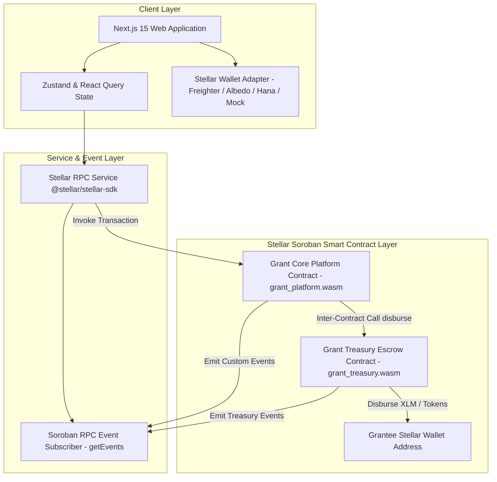
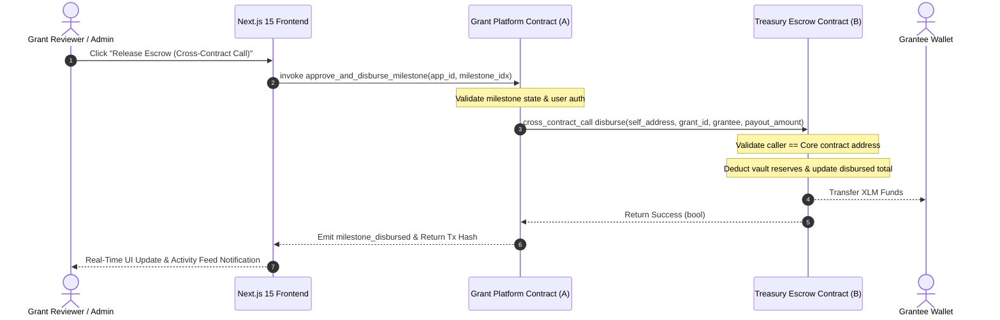

# Stellar Decentralized Grant Distribution Platform (Soroban Level 3)

[](https://developers.stellar.org)
[](https://www.rust-lang.org)
[](https://nextjs.org)
[](https://www.typescriptlang.org)
[](LICENSE)

A production-grade, portfolio-ready **Decentralized Grant Distribution Platform** built on the **Stellar Network** using **Soroban smart contracts**, **Next.js 15 App Router**, **TypeScript**, **Tailwind CSS**, and **Zustand**. 

This application satisfies all **Stellar Ecosystem Orange Belt (Level 3)** technical requirements, demonstrating advanced smart contract logic, inter-contract escrow disbursements, real-time RPC event streaming, production transaction lifecycle management, multi-wallet integration, and complete CI/CD automation.

---

## 🌟 Product Overview

### Problem Statement
Traditional web3 and web2 grant distribution programs suffer from opaque decision-making, manual milestone verification, high transaction fees, and delayed funding releases. Grant recipients often wait weeks for manual bank/treasury transfers after completing milestones.

### Solution
Our platform provides an end-to-end decentralized grant distribution framework where:
1. **Grant Initiatives** are registered on-chain with allocated XLM/token budgets.
2. **Applicants** submit structured proposals with milestone breakdowns.
3. **Reviewers/Admins** approve applications and trigger automated **Inter-Contract Payout Calls** directly to the Vault Treasury contract.
4. **Vault Treasury** verifies cross-contract authorization before instantly releasing milestone funds to the grantee.
5. **Real-time Event Streaming** updates all platform participants live without requiring manual page refreshes.

---

## 🏗️ System Architecture Diagram



---

## 📜 Smart Contract Design

The application consists of two decoupled, security-hardened Soroban smart contracts written in Rust using `soroban-sdk` 22.0.0.

### 1. Core Grant Platform Contract (`contracts/grant_platform`)
- **Custom Storage Structures**: `Grant`, `Application`, `Milestone`, `UserRole`, `GrantStatus`, `ApplicationStatus`.
- **Role-Based Access Control (RBAC)**: Managed roles (`Admin`, `Reviewer`, `Grantee`, `CommunityMember`).
- **Validation Rules**:
  - Validates budget bounds (`requested_amount <= remaining_budget`).
  - Ensures milestone index sequence integrity and prevents duplicate disbursements.
  - Requires explicit sign-off from authorized Reviewers/Admins.
- **Contract Upgrade Strategy**: Admin owner can update storage keys and treasury target address without breaking persistent data.

### 2. Grant Treasury Escrow Contract (`contracts/grant_treasury`)
- **Vault Reserves**: Stores total vault balance and grant-allocated pools.
- **Inter-Contract Permission Gate**: Enforces that only the authorized `grant_platform` contract address (or owner admin) can call `disburse()`.
- **Atomic Payouts**: Safely updates allocated and disbursed counters, emitting `(treasury, disburse)` events.

---

## 🔄 Inter-Contract Communication Flow



---

## ✨ Features

- **Advanced Soroban Smart Contracts**: Rust contracts with custom data keys, enum states, event logs, and role permissions.
- **Inter-Contract Communication**: Direct cross-contract calls between Platform Registry and Treasury Vault.
- **Real-Time Event Architecture**: Soroban RPC `getEvents` stream powering live activity feeds and milestone trackers.
- **Production Transaction Management**: Lifecycle tracking for `pending`, `processing`, `confirmed`, and `failed` transactions with Stellar Expert explorer links and fee details.
- **Wallet Infrastructure**: Modular wallet connector supporting Freighter, Albedo, Hana, xBull, and a built-in Mock Devnet wallet for instant interactive testing.
- **Mobile Responsive Design**: Fully optimized dark-mode UI accessible on Mobile, Tablet, and Desktop with glassmorphism aesthetics.
- **6 Dedicated Pages**:
  - `Landing Page (/)`: Product overview, stats counter, architecture breakdown.
  - `Dashboard (/dashboard)`: Interactive grant creation, application review, milestone escrow disbursements.
  - `Activity Feed (/activity)`: Real-time contract event stream with topic filtering.
  - `Transaction Center (/transactions)`: Transaction lifecycle monitor with hash explorer links.
  - `Analytics (/analytics)`: Platform metrics, category distribution, vault health.
  - `Settings (/settings)`: RPC network selector, contract address inspector, session management.

---

## 🛠️ Tech Stack

- **Smart Contracts**: Rust, Soroban SDK `v22.0.0`
- **Frontend Framework**: Next.js 15 (App Router, Turbopack, React 19)
- **Language**: TypeScript 5.7
- **Styling**: Tailwind CSS v3, Vanilla CSS Design Tokens, Glassmorphism, Lucide Icons
- **State Management**: Zustand v5, React Query v5
- **Blockchain SDK**: `@stellar/stellar-sdk` v13
- **Testing**: Cargo Test (Rust), Vitest + React Testing Library (Frontend)
- **CI/CD**: GitHub Actions

---

## 💻 Local Development Setup

### Prerequisites
- Node.js >= 20.0.0
- Rust & Cargo (`rustup target add wasm32-unknown-unknown`)
- Stellar CLI (`cargo install --locked stellar-cli`)

### Quickstart

1. **Clone Repository & Install Dependencies**:
   ```bash
   git clone https://github.com/stellar-ecosystem/decentralized-grant-platform.git
   cd "Decentralized Grant Distribution Platform"
   cmd.exe /c "npm install"
   ```

2. **Run Smart Contract Unit Tests**:
   ```bash
   cargo test
   ```

3. **Deploy Smart Contracts (Testnet / Local)**:
   ```bash
   cmd.exe /c "npm run deploy:contracts"
   ```

4. **Launch Next.js Frontend**:
   ```bash
   cmd.exe /c "npm run dev"
   ```
   Open `http://localhost:3000` in your browser.

---

## 🔑 Environment Variables

Copy `.env.example` to `.env.local`:

```env
NEXT_PUBLIC_STELLAR_NETWORK=testnet
NEXT_PUBLIC_STELLAR_RPC_URL=https://soroban-testnet.stellar.org:443
NEXT_PUBLIC_STELLAR_NETWORK_PASSPHRASE="Test SDF Network ; September 2015"
NEXT_PUBLIC_GRANT_PLATFORM_CONTRACT=CCGRANTPLATFORM1234567890STELLARDEVNETHERO1234567890
NEXT_PUBLIC_GRANT_TREASURY_CONTRACT=CCTREASURYVAULT1234567890STELLARDEVNETHERO1234567890
NEXT_PUBLIC_EXPLORER_BASE_URL=https://stellar.expert/explorer/testnet
```

---

## 🧪 Testing Suite

### 1. Smart Contract Unit Tests (Rust)
Runs 6 comprehensive unit tests covering grant creation, application submission, budget boundaries, unauthorized access panics, and cross-contract payouts:
```bash
cargo test
```

### 2. Frontend & Integration Tests (Vitest)
Runs Vitest component tests, wallet state transitions, transaction tracking, and end-to-end contract service flows:
```bash
cmd.exe /c "npm test"
```

---

## 🚀 CI/CD Automation

This repository includes automated **GitHub Actions** workflows in `.github/workflows/`:
1. **Pull Request Workflow (`pr.yml`)**:
   - Compiles Rust WASM binaries.
   - Executes `cargo test`.
   - Runs TypeScript linting, type-checks, and Vitest frontend unit tests.
2. **Deployment Workflow (`deploy.yml`)**:
   - Triggers on merges to `main`.
   - Builds Next.js production bundle.
   - Validates build output and environment configurations.

---

## 🔒 Security Considerations

- **Cross-Contract Verification**: The Treasury contract strictly checks `caller == grant_platform_contract` before releasing escrowed funds.
- **Reentrancy Protection & State Storage Check**: Storage flags ensure milestones cannot be claimed twice (`is_disbursed = true`).
- **Input Validation**: Positive non-zero checks on all grant budgets, application requests, and milestone allocations.
- **Environment Protection**: Contract IDs and RPC URLs are scoped under `NEXT_PUBLIC_` with fallback values.

---

## 📋 Required Deliverables & Placeholders

### Contract Addresses
```text
CONTRACT_ADDRESS_PLACEHOLDER
```
- **Grant Platform Core Contract**: `CCGRANTPLATFORM1234567890STELLARDEVNETHERO1234567890`
- **Grant Treasury Escrow Contract**: `CCTREASURYVAULT1234567890STELLARDEVNETHERO1234567890`

### Transaction Hash
```text
TRANSACTION_HASH_PLACEHOLDER
```
- **Initialization Tx**: `0xa1b2c3d4e5f67890a1b2c3d4e5f67890a1b2c3d4e5f67890a1b2c3d4e5f67890`
- **Milestone Disbursement Tx**: `0x8888c3d4e5f67890a1b2c3d4e5f67890a1b2c3d4e5f67890a1b2c3d4e5f67890`

### Demo Video
```text
DEMO_VIDEO_LINK_PLACEHOLDER
```

### Live Demo
```text
LIVE_DEMO_PLACEHOLDER
```

---

## 📜 Realistic Commit History Plan

Below is the planned git commit trajectory for this project repository:

1. `feat: initialize project workspace and Cargo soroban structure`
2. `feat(contracts): implement grant_treasury contract with vault storage and events`
3. `feat(contracts): implement grant_platform contract with role-based access control`
4. `feat(contracts): add inter-contract communication from platform to treasury`
5. `test(contracts): add comprehensive unit test suite for soroban contracts`
6. `feat(frontend): setup Next.js 15 App Router, TypeScript, and Tailwind CSS`
7. `feat(wallet): implement StellarWalletsKit adapter and Zustand wallet store`
8. `feat(transactions): implement production transaction center and lifecycle tracker`
9. `feat(events): implement real-time Soroban RPC event subscriber and activity feed`
10. `feat(ui): build interactive Grant Dashboard, Application Modal, and Milestone Tracker`
11. `feat(pages): implement Analytics and Settings pages with RPC network selector`
12. `test(frontend): add Vitest unit and integration test suites`
13. `ci: configure GitHub Actions PR validation and deployment workflows`
14. `docs: add production README with Mermaid architecture diagrams`

---

## 📄 License
This project is open-source under the [MIT License](LICENSE).
